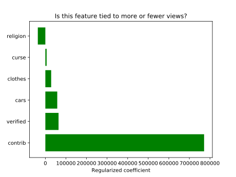

# Rap (Machine) Genius: Creative Consulting for Maximum Views

## Main Premise

### Motivating question
For my regression project, I started with the following premise: let’s say my friend Janelle is an aspiring rapper, and she raised just enough money for a single recording session to take place next week. This is her chance to go viral, but she needs help deciding which songs to record. In her limited time in the studio, should Janelle do that one about her religious faith, or the one about haute couture? Will she be able to get attention without cursing, or bragging about fancy cars?

### Measuring a song’s popularity
Of course, the best metric for measuring the success of a song these days would probably be number of streams, since those directly relate to the financial success of a given song. But listeners are split across various services, including Spotify, Apple Music, Tidal and others, whose statistics I couldn’t figure out how to access reliably. Many popular songs _are_ available on YouTube, which _does_ display the number of views, but despite YouTube’s best efforts to sell people on their streaming service, YouTube isn’t where most people go to listen to music. Besides, the number of views a song gets on YouTube is inflated by the production value of the music video, if there is one. That has nothing to do with the lyrics.

### Caveats
Of course, people don’t choose to listen to a song based on its lyrics alone. They tune in for a number of reasons: maybe they already like the artist, maybe the beat is eminently danceable, maybe the melody is super catchy. But that’s okay—my purpose here is not to build a model that will predict the exact number of clicks, but rather just tease out some of the relationships between certain topics and page views.

## Web scraping
### Genius.com
In the end, I decided to scrape information from the lyrics hosting website Genius.com. This is a website that offers not just the raw lyrics to a song, but also crowd-sourced annotations that explain the references or meaning behind certain lines. Let’s say you’re listening to God’s Plan by Drake, and the lyric “Turn the O2 into the O3” leaves you scratching your head. You might go to the [song’s page on Genius.com](https://genius.com/Drake-gods-plan-lyrics "God's Plan") where you’d learn that Drake once performed with Travis Scott at the O2 arena in London. When his fellow performer Travis Scott fell off the stage, Drake refunded the whole crowd, turning the O2 into the “O-free.”

Conveniently, Genius.com makes the number of page views publicly available. Of course, songs with especially complex lyrics and obscure references may attract significantly more views there than you might expect based on their popularity. Those caveats aside, for the purposes of this project, I assume that the number of page views a song has on Genius.com is a decent proxy for the popularity of a song.

### Data scraped by Selenium Chrome driver
The next step was to gather the data. Since I was only interested in rap songs, I used a Selenium Chrome driver to scrape links to the pages of the top 1,000 songs that were assigned the Rap tag.

Then, still using the Selenium driver, I visited every page on the list, gathering the following data as I went along: the lyrics themselves (ignoring the annotations), some metadata categories, including the number of views (which will be the target in my linear regression model), the tags associated with the song, and the number of people who contributed annotations to explain the song’s lyrics.

I also kept track of whether the song featured what the website calls Verified Contributions. This tells you whether the artist herself, or the songwriter, or one of the producers, are among the people who submitted explanations of the lyric. (See below for an example.)

## Feature engineering

Once I had all this information for each one of the 1,000 songs, I used a simple bag-of-words model to count the number of times certain words appeared in a song, then divided that count by the number of words in the song to get a normalized score for the various crudely assembled topics I created. For instance, the “clothes” topic featured brand names like “Gucci,” “Fendi,” “Prada,” “Louis Vuitton,” “Dior,” and others. The “curse” topic featured most of the FCC’s 68 banned words, the “cars” topic featured brand names of especially famous luxury cars, like “Bugatti,” “Porsche,” and “Ferrari,” while the “religion” topic featured words like “God,” “Lord,” “Jesus,” “Devil,” and “faith.”

## Exploratory Data Analysis
### Distribution after cleaning
I had to remove 24 songs that were in languages other than English. Only 28 songs boasted 5 million views and above. Most were at or below the million view mark.

Unsurprisingly, most of the songs’ lyrics were explicit: all of the songs but 83 featured some kind of curse word. More than one third of the songs in the top 1,000 rap songs didn’t register a single “religious” word, which makes sense. Few rappers make religion their focus.

### Sanity check
A quick sanity check shows that my topics are indeed picking up on the right songs. The top-scoring songs in the “clothes” metric are [_Versace_ by Migos](https://genius.com/Migos-versace-lyrics), [_Gucci Gang_ by Lil Pump](https://genius.com/Lil-pump-gucci-gang-lyrics) and [_Gucci Gucci_ by Kreayshawn](https://genius.com/Kreayshawn-gucci-gucci-lyrics). Same thing with “cars”: top scorers were [_Bugatti_ by Ace Hood](https://genius.com/Ace-hood-bugatti-lyrics) and [_Yamborghini High_ by A$AP Mob](https://genius.com/A-ap-mob-yamborghini-high-lyrics). “Curse” picked up on some foul-mouthed anthems. You shouldn’t be surprised to see Kanye West top the “religion” metric.

## Modeling

Having ensured that the data was relatively clean, and the features were operating the way I expected them to, I set up a simple Linear Regression model with page views as the target using Ordinary Least Squares. Then I applied a Standard Scaler transformation, followed by Ridge regularization so that I could compare the coefficients for the various features side by side.

### Strongest features: audience engagement
Let’s start with the two strongest results, which had high coefficients _and_ low p-values. The more people contributed to a song’s page, the more page views a song had. Having a “verified” contributor also had a positive effect on the number of page views.

### Topic strength
As far as the topics are concerned, the only one that had a negative impact on the page views was the “religion” category. Does that mean that Kanye West was right? In _Jesus Walks_ (2004), West rapped:

> They say you can rap about anything except for Jesus
>
> That means guns, sex, lies, videotape
>
> But if I talk about God my record won't get played, huh?

Not so fast. The p-value is somewhat high: 0.23. By contrast, the “cars” feature had a positive effect on the number of views, but its p-value was 0.06, much closer to the standard 0.05 threshold for statistical significance.

Cursing and bragging about clothes had positive coefficients, but they also had higher p-values (0.842 and 0.358 respectively). Talking about luxury cars, on the other hand, had both a positive coefficient _and_ a low p-value (0.06).

## Conclusions
### Topics
So what advice would I give to my friend Janelle? I would advise her to stick to her guns in terms of religion. Sure, the coefficient was negative, but it’s not that common for rappers to talk about faith, so it might help her stand out! In a similar way, she shouldn’t feel compelled to curse just to fit in, especially if people are cursing sort of reflexively. She may find it to her advantage to talk about luxury cars, though. But she could rap about how little she cares about them, and still benefit from the boost!

### Audience engagement
Once the songs are released to the public, I would want to tell all my friends to contribute annotations on Genius, since that seems to boost the number of views. Janelle should volunteer her “verified” contributions, too! That will boost views, and also make sure people get what she was trying to say.

PS: As an added bonus, just for kicks, here’s the relative effect of various brands on the page views.

