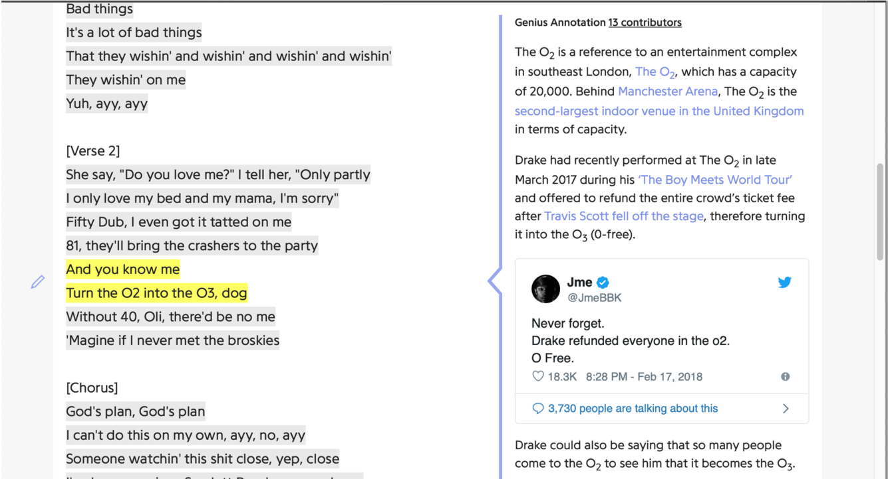
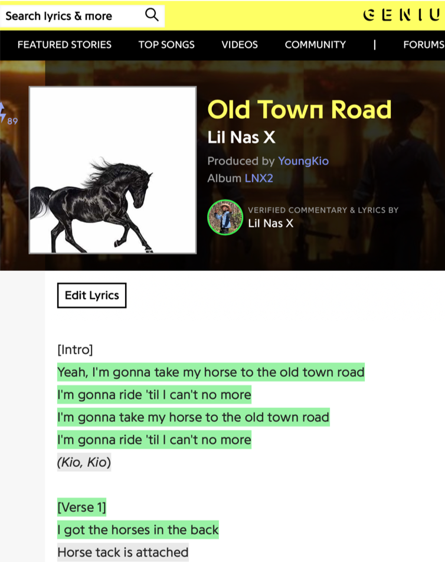
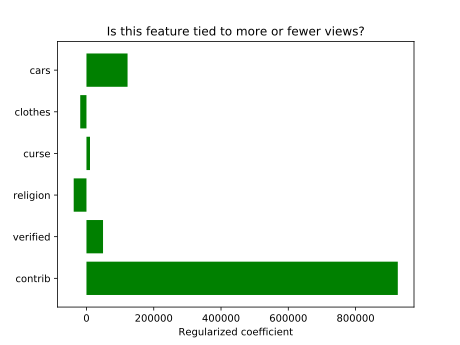
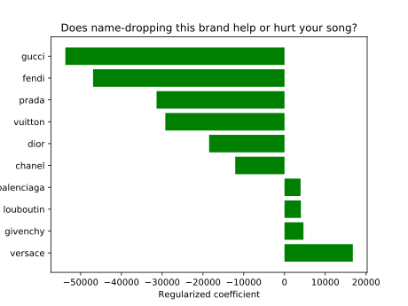

# Rap (Machine) Genius:
## Creative Consulting for Maximum Views

For my regression project, I started with the following premise: let’s say you have a friend named Janelle who is an aspiring rapper, and she raised just enough money for a single recording session to take place next week. This is her chance to make an impression and go viral, but she needs help deciding which songs to play. In her limited time in the studio, should Janelle do that one about her religious faith, or is she better off rapping about couture? Will she be able to get attention without cursing, or bragging about fancy cars?

Of course, the best metric for measuring the success of a song these days would probably be number of streams, since those directly relate to the financial success of a given song. But streaming revenue is split across various services, including Spotify, Apple Music, Tidal and others, whose statistics I couldn’t figure out how to access reliably. Many popular songs are present on YouTube, which does display the number of views publicly, but that figure ends up being inflated by the production value and quality of the music video, if there is one, which makes it an unreliable metric for lyrics.

Another caveat: of course, the content of a song’s lyrics only contributes a small amount to the popularity of a song. Songs get popular in large amount because they feature an artist who is already popular, or just because they went viral. But I am not looking to build a model that will predict the exact number of clicks, but rather just tease out some of the relationships between topics and page views.

In the end, I decided to scrape information from the lyrics hosting website Genius.com. If you’re not familiar with Genius.com, this is a website that offers not just the raw lyrics to a song, but it also provides crowd-sourced annotations that explain the references or meaning behind certain lines. Let’s say you’re listening to God’s Plan by Drake, and the lyric “Turn the O2 into the O3” leaves you scratching your head. You could go to the [song’s page on Genius.com](https://genius.com/Drake-gods-plan-lyrics "God's Plan") and you’d learn that Drake once performed with Travis Scott at the O2 arena in London. When his fellow performer Travis Scott fell off the stage, Drake refunded the whole crowd, turning the O2 into the “O-free.” 

I was drawn to Genius.com because they display the number of page views publicly. Of course, instrumental songs won’t appear on this website, and songs with uninteresting lyrics are probably not going to be looked up often, relative to how popular they are. On the flip side, songs with especially complex lyrics and obscure references may attract significantly more views than you might expect based on their popularity. Those caveats aside, for the purposes of this project, I assume that the number of page views a song has on Genius.com is a decent proxy for the popularity of a song.

The next step was to gather the data. Since I was only interested in rap songs, I consulted the top songs that were given the Rap tag. That gave me a scrollable page with a list of the top songs ranked by page views. I used a Selenium Chrome driver to scroll to the very bottom of the page, which would not display more than 1,000 at a time. Then I grabbed the links to each of the pages on this list.

Once I had the 1,000 links, again using Selenium, I visited every page on the list, gathering the following data as I went along. I gathered the lyrics themselves (ignoring the annotations), a certain number of metadata, including the number of views (which will be the target in my linear regression model), the tags associated with the song, the number of people who contributed annotations to explain the song’s lyrics. 

I also kept track of whether the song featured what the website calls Verified Contributions.  This tells you whether the artist herself, or the songwriter, or one of the producers, are among the people who submitted explanations of the lyric. This is something that we’d expect to contribute positively to the number of views of a given song’s page. The site is pretty successful at ensuring the quality of these contributions—you have to have a certain amount of seniority to be allowed to comment on songs that have become popular. But I’m probably not alone in being more likely to visit and share the Genius page for a song if it has the inside scoop on the song.

Once I had all this information for each one of the 1,000 songs, I used a simple bag-of-words model to count the number of times certain words appeared in a song, then divided that count by the number of words in the song to get a normalized score for the various crudely assembled topics I created. For instance, the “clothes” topic featured brand names like Gucci, Fendi, Prada, Louis Vuitton, Dior, and others. The “curse” topic featured most of the FCC’s 68 banned words, the “cars” topic featured brand names of especially famous luxury cars, like “Bugatti,” “Porsche,” and “Ferrari,” while the “religion” topic featured words like “God,” “Lord,” “Jesus,” “Devil,” and “faith.”

I had to remove 24 songs that were in languages other than English. Only 28 songs boasted 5 million views and above. Most were at or below the million view mark. Unsurprisingly, most of the songs’ lyrics were explicit: all of the songs but 79 featured some kind of curse word, at least as they were defined in my project. More than one third of the songs in the top 1,000 rap songs didn’t register a single “religious” word. Which makes sense. With a few notable exceptions, like Kanye West or Lauryn Hill, rappers don’t tend to spend a whole lot of time rapping about God.

A quick sanity check shows that my topics are indeed picking up on the right songs. The top-scoring songs in the “clothes” metric are [_Versace_ by Migos](https://genius.com/Migos-versace-lyrics), [_Gucci Gang_ by Lil Pump](https://genius.com/Lil-pump-gucci-gang-lyrics) and [_Gucci Gucci_ by Kreayshawn](https://genius.com/Kreayshawn-gucci-gucci-lyrics). Each one of these songs has a chorus where some brand name is chanted repeatedly. Same thing with “cars”: top scorers were [_Bugatti_ by Ace Hood](https://genius.com/Ace-hood-bugatti-lyrics) and [_Yamborghini High_ by A$AP Mob](https://genius.com/A-ap-mob-yamborghini-high-lyrics). “Curse” picked up on some foul-mouthed anthems. With a title like [_STFU_](https://genius.com/Pink-guy-stfu-lyrics), you know it’s going need a parental advisory. Last but not least, I wasn’t surprised to see Kanye West top the “religion” metric with his song [_Ultralight Beam_](https://genius.com/Kanye-west-ultralight-beam-lyrics).

Having ensured that the data looked clean enough, and the features were operating the way I expected them to, I set up a Linear Regression model with page views as the target. I applied Lasso regularization and a Standard Scaler transformation so that I could compare the coefficients for the various features side by side. Here are the results.  

Let’s start with the two strongest results. The more people contributed to a song’s page, the more page views a song had. Having a “verified” contributor also had a positive effect on the number of page views. Both of these results aren’t too surprising. After all, the number of contributors itself is a proxy for a song’s popularity. But still, if I were an aspiring rapper hoping to get attention on Genius, I would encourage people to contribute to the page. The p-value for that effect was very low, so I can say with confidence that the effect was statistically significant. The strength of the “verified” effect is a sign that I might want to encourage Janelle to comment on her own lyrics. Of course, this is an effect that is strongest when we’re talking about more popular acts, but the p-value is 0.004, so we have another effect that is of definite statistical significance.

As far as the topics are concerned, the only one that had a negative impact on the page views was the “religion” category. Does that mean that Kanye West was right? In _Jesus Walks_ (2004), West rapped: 
> They say you can rap about anything except for Jesus 
> That means guns, sex, lies, videotape
> But if I talk about God my record won't get played, huh?
Not so fast. The p-value is very high: 0.70. So there’s only a 30% probability that the effect is statistically significant.

So what advice would I give to my friend Janelle? I would definitely encourage her to rap about haute couture. The coefficient that topic’s positive effect on page views was high, and the p-value was 0.05. I would also advise her to stick to her guns in terms of religion. Sure the coefficient was negative, but it’s not that common for rappers to talk about faith, so it might help her stand out!

Here’s the relative effect of various brands on the page views. 
